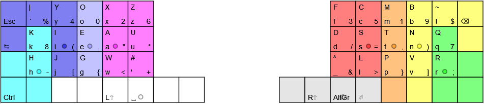

# x1.tsu
In-progress layout, inspired by x1 and BEAKL27 for an ortho40 keyboard (such as planck, ergolinear, ergodox). Uses a different finger layout to standard with pinky fingers dropped to bottom row.

Position of thumb keys: [Shift, Space, AltGr, Enter] should be adjusted to have thumbs resting on Space and AltGr, with LShift and Enter placed in the more comfortable side key.

The circle symbols indicate resting position, and the coloured keys indicate which finger is responsible for pressing which key. Note the minimal usage of the pinky, with the KH and QR bigrams. Key placement could be further developed with this [information](https://www.petercollingridge.co.uk/blog/language/analysing-english/bigrams/) on bigrams in English, however I did not spend too much time thinking about this as I plan on typing in Japanese as well.

Usage of this layout requires a keyboard which can define custom layers using QMK or otherwise. The Shift button also needs to be set up as a custom layer, due to the use of symbols.

## Explanation of layout design

to-do, but tl;dr:

- Base layout mostly inspired by [x1](https://www.keyboard-design.com/letterlayout.html?layout=x1_atreus-44-keys.en.ergodox), but with pinky down shifted and hands shifted outward, and some small letter swaps inspired by [BEAKL27](https://www.keyboard-design.com/letterlayout.html?layout=beakl-27a.en.matrix).
- Base layout was designed to have alpha keys mirrored, unlike layouts such as QWERTY, DVORAK etc.
- Alt layer has numbers raised one key above resting position, with left hand typing even numbers, and right hand typing odd numbers (following x1, I assume this is based on frequency of number in relation to ease of keypress). Number order should be changed as desired, to 01234 56789 (standard) or 32104 76598 (beakl27).
- Alt layer uses a mirrored open/close brackets for faster learning
- Symbols which are commonly typed following numbers (in programming/maths) are also placed on the alt layer to prevent unneccesary layer swaps. Other symbols are prioritised by usage (from my own anecdotal feeling).
