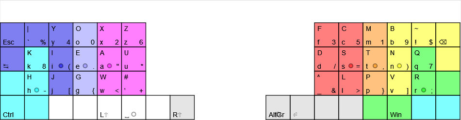

# x1.tsu
In-progress layout, inspired by x1 and BEAKL27 for an ortho40 keyboard (such as planck, ergolinear, ergodox). Uses a different finger layout to standard with pinky fingers dropped to bottom row.

